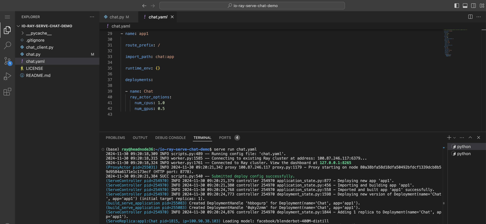

# io-ray-serve-chat-demo

a Ray Serve Chat Demo Serving Hugging Face Models

## How to get started

1. Open Up [io.net](https://io.net) account
2. Follow through standard procedure on launching a Ray Cluster. Select a small cluster, for example 4 T4.
3. When the cluster is ready, select Visual Studio Code (VSCode)
   

4. Launch Visual studio code terminal and clone this repo

```bash
git clone https://github.com/ionet-official/io-ray-serve-chat-demo.git
```

5. Go to the folder

```bash
cd  io-ray-serve-chat-demo
```

6. Start the chat server via

```bash
serve run chat.yaml
```

   

7. Wait till the Ray serve deploys the chat app across workers. You will see on the terminal a "Model loaded" message.
8. Test your Chatbot from the cluster. Open a new terminal and run the sample chat client

```bash
python chat_client.py
```

   

9. Test your Chatbot server endpoint from outside the Cluster
   1. Server endpoint: `https://exposed_service-[YOUR-CLUSTER-SUFFIX].headnodes.io.systems/`
   2. If your cluster suffix is `1d47a`, then: `https://exposed_service-1d47a.headnodes.io.systems/`
   3. One way to identify your prefix is from the the VSCode URL, which looks like `https://vscode-1d47a.headnodes.io.systems/`
   4. You can use below code snippet to interact with the Ray serve application created (update the endpoint to your server)

```python
import requests
SERVER_ENDPOINT = "https://exposed_service-1d47a.headnodes.io.systems/"
message = "What is the capital of France?"
history = []
response = requests.post(SERVER_ENDPOINT, json={"user_input": message, "history": history})
print(response.json())
```

or on a terminal:

```bash
curl -X POST https://exposed_service-1d47a.headnodes.io.systems/ \
-H "Content-Type: application/json" \
-d '{"user_input": "What is the capital of France?", "history": []}'

```

